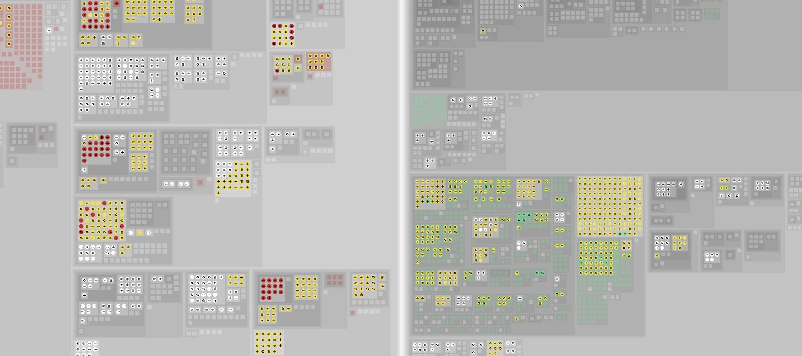
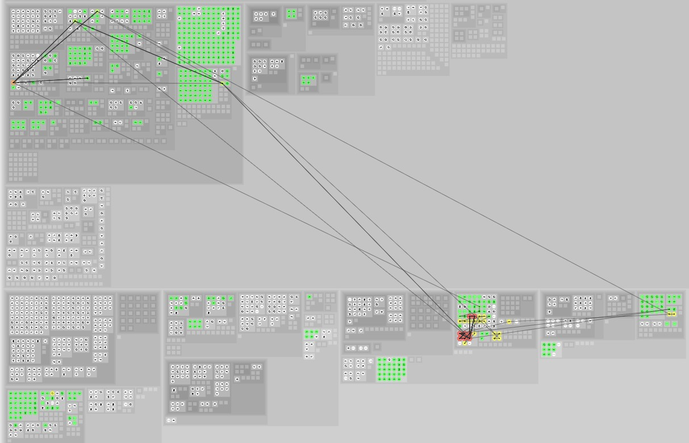
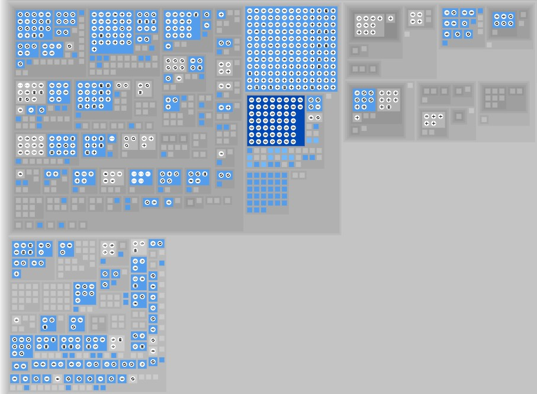
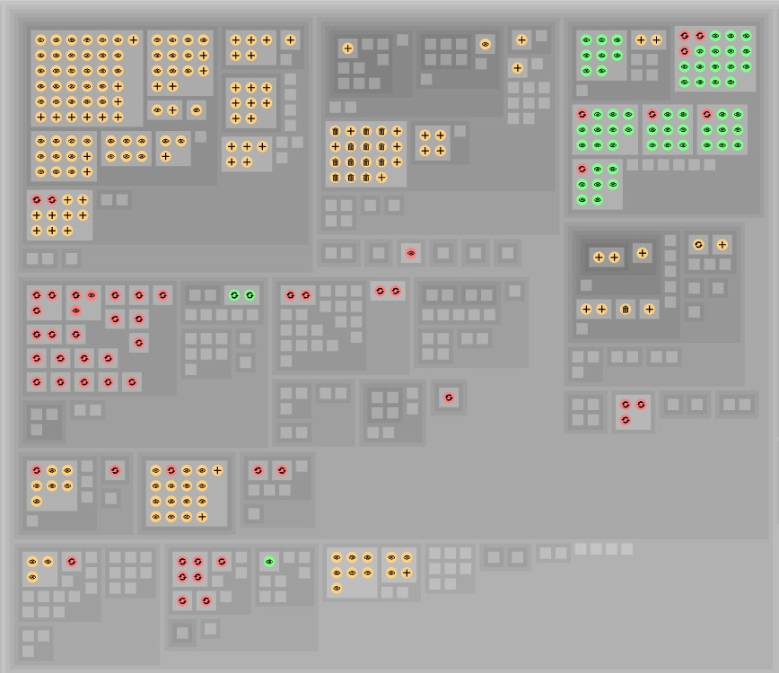
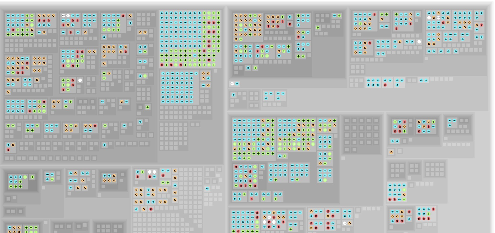
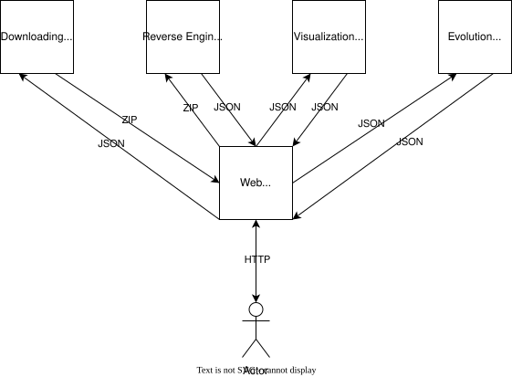

# DENIM


## 📣 Description

DENIM is a tool aiming to provide software developers support in downloading, reverse engineering, visualizing, and evolving microservices architecture. Further details of each goal are provided in respective repositories referenced hereafter.

This documentation repository aims to explain the overview of the tool in terms of objectives and technical details (e.g. architecture diagram, languages and technologies).

<p align="center">
  
  
  
  
  
</p>

## 📝 How to cite?

```latex

%%% Cite the paper

@inproceedings{andre2025c,
  title         = {DENIM: Exploring Data Access in Microservices},
  author        = {Andr{\'e}, Maxime and Raglianti, Marco and Cleve, Anthony and Lanza, Michele},
  booktitle     = {Proceedings of the 41st International Conference on Software Maintenance and Evolution (ICSME 2025): Tool Demo track},
  year          = {2025},
  organization  = {IEEE Computer Society Press},
  doi           = {https://doi.org/10.1109/icsme64153.2025.00103}
}
```

## 🪛 Technical details

### Architecture

The tool is developed itself as a microservices architecture. The architecture diagram is depicted below.



The architecture components are described below.

| Microservice        | Port  | Input | Output | Description                                                                                                                                                                                                                                                                                                                                                                   | Repository                                                                                           |
|---------------------| ----- | ----- | ------ |-------------------------------------------------------------------------------------------------------------------------------------------------------------------------------------------------------------------------------------------------------------------------------------------------------------------------------------------------------------------------------|------------------------------------------------------------------------------------------------------|
| Web                 | :8080 | HTTP  | HTTP   | This microservice is the user interface of the tool. It interacts through HTTP requests with the user. It also communicates with other services through API requests in order to respond to user's needs according to the proposed features.                                                                                                                                  | [Web](https://github.com/DatabaseEvolutionNudgeInMicroservices/web/)                                 |
| Downloading         | :8081 | JSON  | ZIP    | This microservice aims to help the user to download, in one shot, with git, one or several microservices applications composing a microservices architecture and spread across multiple, distributed, and heterogenous repositories. According to a given JSON list of repositories links and hash as input, it returns a ZIP file containing all the architecture as output. | [Downloading](https://github.com/DatabaseEvolutionNudgeInMicroservices/downloading/)                 |
| Reverse Engineering | :8082 | ZIP   | JSON   | This microservice aims to reverse engineer, statically and dynamically, a microservices architecture in order to retrieve insights about the data access. According to a given ZIP file containing the microservices architecture as input, it returns a requested analysis report in JSON as output.                                                                         | [Reverse Engineering](https://github.com/DatabaseEvolutionNudgeInMicroservices/reverse-engineering/) |
| Visualizing         | :8083 | JSON  | JSON   | This microservice aims to transform a static analysis report into visualizations. According to given a analysis report in JSON as input, it returns a one of the requested visualization model object in JSON as output.                                                                                                                                                      | [Visualizing](https://github.com/DatabaseEvolutionNudgeInMicroservices/visualizing/)                 |
| Evolving            | :8084 | JSON  | JSON   | This microservice aims to retrieve, based on an analysis report, some evolutionary insights. According to a given analysis report in JSON as input, it returns a one of the requested evolution insight in JSON as output.                                                                                                                                                    | [Evolving](https://github.com/DatabaseEvolutionNudgeInMicroservices/evolving/)                       |

Comments:

- Each microservice have a `Dockerfile` file and a `docker-compose.yml` file.
- ⚠️ Port exposed in respective `Dockerfile` files of each repository corresponds to the concerned technology's default one. In addition, each respective `docker-compose.yml` file of each repository maps by default this same default port. ⚠️ Pay attention that for the complete deployment, it is required to use different ports for each service. The overall `docker-compose.yml` file described in the [Deployment](#deployment) section proposes an example according to the port illustrated in the diagram above.

### Deployment

See [INSTALL file](INSTALL.md).

### Technologies

As recommended in microservices architectures, each microservice motivates their own technology choices. See respective repositories for further details.

### Libraries

As recommended in microservices architectures, each microservice motivates their own libraries choices. See respective repositories for further details.

### Tools

As recommended in microservices architectures, each microservice motivates their own tool choices. See respective repositories for further details.

## 🤝 Contributing

Contributions guidelines are described in each repository. See respective repositories for further details.

## 📖 References

[André, M., De Rycke, M., Henrotte, A., Raglianti, M., Rivière, E., Di Penta, M., Cleve, A., & Lanza, M. (2026). DENIM.](https://doi.org/10.5281/zenodo.16414747)

[André, M., Raglianti, M., Cleve, A., & Lanza, M. (2025, September). DENIM: Exploring Data Access in Microservices. In Proceedings of the 41st International Conference on Software Maintenance and Evolution (ICSME 2025): Tool Demo track (pp. 900-904). IEEE.](https://doi.org/10.1109/icsme64153.2025.00103)

[André, M., Rivière, E., & Cleve, A. (2025, March). Data Access-centered Understanding of Microservices Architectures. In Proceedings of the 22nd International Conference on Software Architecture Companion (ICSA-C): NEMI track (pp. 6-10). IEEE.](https://doi.org/10.1109/icsa-c65153.2025.00007)

[André, M., Raglianti, M., Cleve, A., & Lanza, M. (2025, April). Understanding Data Access in Microservices Applications Using Interactive Treemaps. In Proceedings of the 33rd International Conference on Program Comprehension (ICPC): ERA track (pp. 216-220). IEEE/ACM.](https://doi.org/10.1109/icpc66645.2025.00030)

[André, M., Raglianti, M., Cleve, A., & Lanza, M. (2025, September). Visualizing and Exploring Data Access in Microservices Using Interactive Treemaps. In Proceedings of the 13th Working Conference on Software Visualization (VISSOFT): Research track (pp. 36-46). IEEE.](https://doi.org/10.1109/vissoft67405.2025.00012)

[De Rycke, M., André, M., Raglianti, M., Cleve, A., & Lanza, M. (2025, September). Visualizing Data Access Traces in Microservices Using Animated Heat Treemaps. In Proceedings fo the 13th Working Conference on Software Visualization (VISSOFT): NIER track (pp. 74-78). IEEE.](https://doi.org/10.1109/vissoft67405.2025.00017)